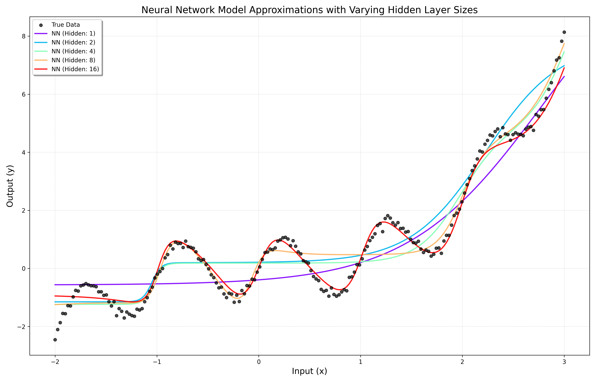

# C++ Automatic Differentiation Library with ML Examples

## 🚀 Overview

This project is a lightweight C++ library implementing core automatic differentiation (autodiff) capabilities, both forward and reverse modes. It also provides examples of applying autodiff to build simple machine learning models (like linear regression and a small neural network) and optimization algorithms (like SGD and Adam).




The goal is to provide a clear and self-contained demonstration of autodiff principles and their practical application in numerical optimization and machine learning contexts using modern C++.

## ✨ Features

* **Automatic Differentiation:** Implementations of forward and reverse mode autodiff primitives.
* **Machine Learning Models:** Simple implementations of Linear and basic Feedforward Neural Network models.
* **Optimizers:** Gradient-based optimization algorithms including Stochastic Gradient Descent (SGD) and Adam.
* **Newton's Method:** A basic implementation of Newton's method for root finding/optimization (likely uses autodiff for Jacobian/Hessian).
* **Modern C++:** Written using modern C++ standards (likely C++20 based on CMake).
* **Eigen Integration:** Leverages the Eigen library for efficient vector and matrix operations (indicated by `EigenSupport.hpp`).
* **CMake Build System:** Easy to build and integrate into other projects using CMake.

## 🏗️ Getting Started

### Prerequisites

* A C++20 compliant compiler (GCC, Clang, MSVC).
* CMake (version 3.10 or higher recommended).
* The Eigen library. You can typically install this via your system's package manager (e.g., `sudo apt-get install libeigen3-dev` on Ubuntu) or include it as a subdirectory/fetchcontent in your CMake.

### Building

1.  Clone the repository:
    ```bash
    git clone <repository_url> # Replace with your repo URL
    cd <project_directory>
    ```
2.  Create a build directory and navigate into it:
    ```bash
    mkdir build
    cd build
    ```
3.  Run CMake to configure the project and generate build files:
    ```bash
    cmake ..
    # For a Debug build (common when developing):
    # cmake -DCMAKE_BUILD_TYPE=Debug ..
    ```
    *(Note: If Eigen is not found by CMake, you might need to provide its path using `-DEigen3_DIR=/path/to/eigen3/cmake` or similar, depending on how Eigen was installed).*
4.  Build the project using your chosen build tool (typically `make` or `ninja`):
    ```bash
    make
    # Or:
    # ninja
    ```

This will compile the library, examples, and tests.

## 🏃 Running Examples

After building the project, the executables for the examples will be located in your build directory (e.g., `./build/`).

Navigate to the build directory and run the examples:

```bash
cd build
./linear_neural_comparison
./NeuralHiddenSizeComparison
./newton_test
# ... and any other example executables you have
