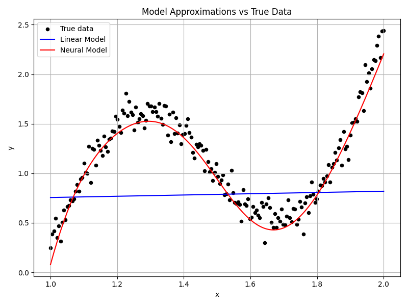
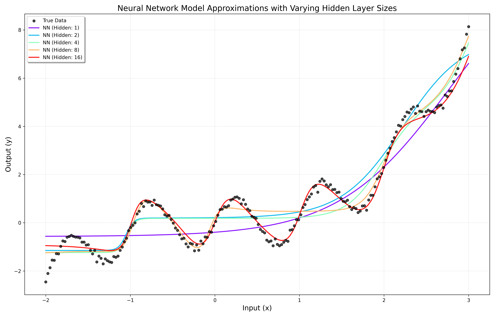
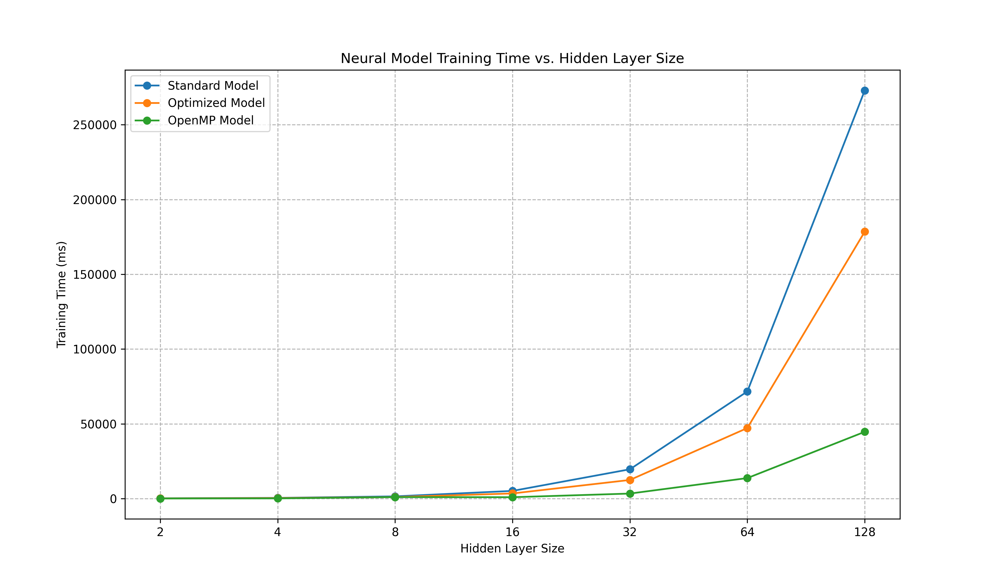
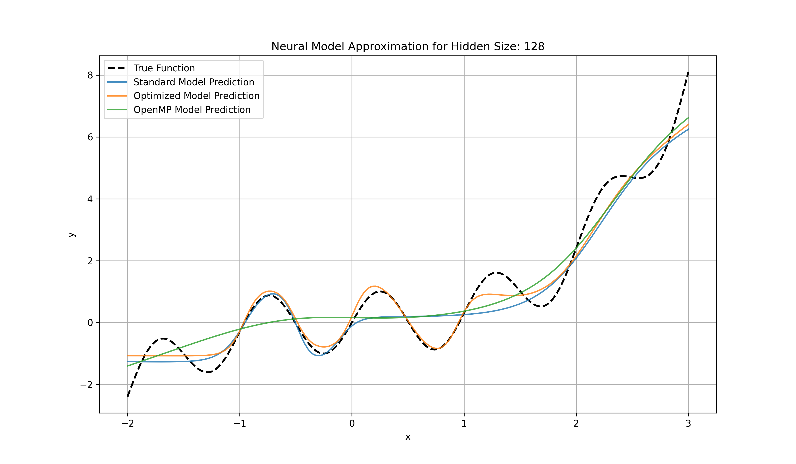

# Model Implementations and Tests

## Overview

This part illustrates how we can use forward-model automatic differentiation to build an example product, typically a model that can approximate an arbitrary function.

---

## ✨ Classes

* **Linear Model:** Implementation of 2 parameters to be optimized (w and b).
* **Parallel Linear Model:** Uses parallel `for` loops on batches of data.
* **Neural Model:** A basic 2-layer feed-forward neural network implementation.
* **Cache-Optimized Neural Model:** Uses `std::span` to point to a unique, contiguous, flat memory where the parameters are located.
* **Parallel Neural Model:** Leverages OpenMP threads working on meta-batches, parallelizing mini-batches.

---

## 🏗️ Implementations and Tests

### Linear Model and Parallel Linear Model

The comparison test in ("LinearModel.cpp"):

On 100 datapoints, `batch_size` 20, SGD `lr = 0.01`

```bash
Serial training took: 90722 microseconds
w: 4.99575 | b: -2.01084
Parallel training took: 28838 microseconds
Speed Up is 3.14592
```
Although there is a speed up, the convergence is diminished, to have the same approximated parameter, the linear model took `200` epochs, whereas the parallel model worked for `1000` epochs.

### Linear model and Neural Model

This is a comparison of how different models approximate the same function.
```bash
Adam lr = 0.03
epochs = 1000
batch_size = 16
hidden_size of the neural model is 8. There are a total of 3*8 + 1 parameters.
```




### Neural network model with different hidden sizes
There is an illustration of how different sizes of parameters affect the approximation.
The total parameters of this 2 model with 2 layers is `3 * hidden_size + 1`.

```bash
 const int N = 200; // Number of data points
 adam lr = 0.03
std::vector<int> hidden_layer_sizes = {1, 2, 4, 8, 16};
epochs = 1000

```




### Tests of performance between standard, optimized, and openMP models

```bash
    const int DATA_SIZE = 100; // Fixed data size
    const int EPOCHS = 500; // Number of training epochs
    const int BATCH_SIZE = 5; // Batch size
    std::vector<int> hidden_sizes = {2, 4, 8, 16, 32, 64, 128}; // Testing a wider range of hidden sizes
    adam lr = 0.03
```


The performance:
As you can see the optimized model is a constant speed-up compared to the serial model, where using more threads gives an exponential speed-up.



The approximation:

Talking about this approximation, we can see that the optimized and standard models are good approximations, but when we talk about AI, too much approximation can lead to overfitting. Whereas the parallelized model is not that approximated, because the averaged gradients somehow destroy the SGD effect, it generally approximates well the trend.




